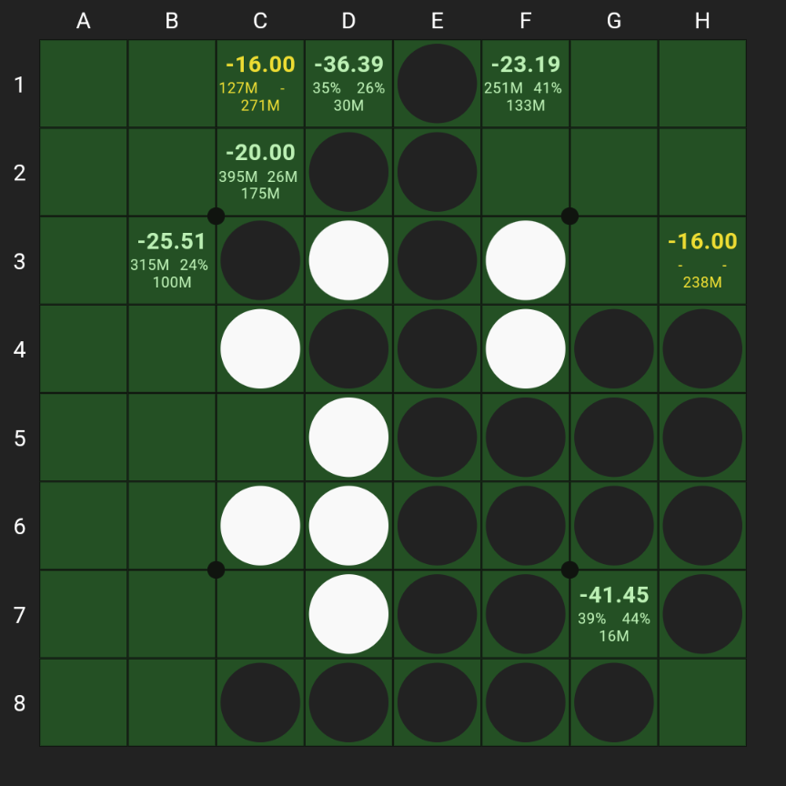

# Othello Sensei

A strong, responsive, and user-friendly [Othello](https://en.wikipedia.org/wiki/Reversi) engine
for advanced players.

## Installing the app

### Android

Download it from the Play Store
([link](https://play.google.com/store/apps/details?id=com.othellosensei.app)).

### iOS

Download it from the App Store
([link](https://apps.apple.com/us/app/othello-sensei/id6738860855?platform=iphone)).

### Windows

#### Using the Microsoft Store

Download it from the Microsoft Store
([link](https://apps.microsoft.com/detail/9n54cs9f3jgp?hl=en-us&gl=US)).

#### Using the msix file

1. Open this [link](installers/Othello%20Sensei.msix).
2. Click CTRL+shift+S at the same time or click on "..." > "Download" (it might take a few seconds
   before the download actually starts).
3. Double click on the installer and follow the instructions.

### Mac

#### Using the App Store

Download it from the App Store
([link](https://apps.apple.com/us/app/othello-sensei/id6738860855?platform=mac)).

#### Using the dmg file

1. Open this [link](installers/Othello%20Sensei.dmg).
2. Click cmd+shift+S at the same time or click on "..." > "Download" (it might take a few seconds
   before the download actually starts).
3. Install the app from the `.dmg` file, following these
   [instructions](https://support.apple.com/en-gb/guide/mac-help/mh40616/mac) to ignore the
   unidentified developer error.

WARNING: Select the right operating system in the webpage with the instructions to ignore the
unidentified developer error.

WARNING: You must ignore the error TWICE, once to open the .dmg, once to open the .app file from the
applications.

### Linux

1. Install Snap if it's not already installed
   ([instructions](https://snapcraft.io/docs/installing-snapd)).
2. Run in a terminal: `sudo snap install othello-sensei`.

## After the installation

1. Download the latest book from the menu.
2. Download the latest archive from the menu.
3. Open the settings and customize the app as you prefer. Examples:
   - Reduce or increase margins.
   - Round the evaluations.
   - Hide extra evaluation information.
   - Enable undo or redo when clicking on illegal moves.

## How does the program work

### Evaluating at depth 1

Similarly to existing programs, Sensei uses a
[pattern-based evaluation](https://skatgame.net/mburo/log.html), but with
different subsets of the board to define patterns:

*	3x3 corners;
*	5x2 corners;
*	main diagonals;
*	some "edge-based" pattern: a list of patterns describing the edge, of which
  Sensei always choose the outermost.

Then, Sensei uses linear regression to evaluate a position using these features.

### Evaluating at larger depths

Sensei uses a new tree search algorithm, developed by myself and currently not published (I might
publish it in the future, but I currently don't have enough time to write a paper). The algorithm
provides the following advantages over standard alpha-beta pruning:

- Provides continuous updates to the value of a position (while alpha-beta can update the value only
  after finishing the search at a given depth).
- Estimates how long it takes before solving the position.
- Provides a natural extension to expand the most "interesting" positions in an opening book.

## Contributing to the app

At the moment, the code is not in a state which allows multiple people to collaborate. If you want
to contribute, please contact michele.borassi@gmail.com and we can discuss.

## Planned features

I'm considering adding the following features in the future (but I cannot guarantee a timeline):

- Download smaller opening books, for phones with little storage.
- Save and load games.
- Better support for the archive (click on a game to play a move, winning percentages, etc).
- Support for XOT.
- Play against the engine (maybe a weaker version).

If one of these features is really important for you, please write an email to
michele.borassi@gmail.com to help me prioritize. Also, if you want a different feature, please write
me and I'll consider it!

## FAQ

### Is the app free?

Yes. Every feature in the app is and will always be free. There are no ads, and there never will be.

### Can I make a donation?

Thank you very much for thinking of making a donation!

However, this app is my pet project, and I don't want to earn money from it. But I'd be really happy
if you could make a donation to the World Othello Federation
([website](https://www.worldothello.org)) and cc me (michele.borassi@gmail.com).

### Can I make the analysis faster?

Yes, edit the setting "Seconds/positions in game analysis" to less than 1 (you can open the
settings from the three dots menu in the top right corner). The values in the analysis will be less
precise, though.

### Can I make the values in the analysis more precise?

Yes, edit the setting "Seconds/positions in game analysis" to more than 1 (you can open the
settings from the three dots menu in the top right corner). The analysis will take more time,
though.

### The app consumes a lot of battery on my phone. What can I do?

Evaluating a position is hard and costs a lot of energy, which translates to high battery
consumption. You can make the program use less energy by reducing the "Number of threads" in the
settings (but the evaluation will be slower).

### The fan on my computer is very loud when using Sensei. What can I do?

Evaluating a position is hard and costs a lot of energy, which increases the CPU temperature and
starts the fan. You can make the program use less CPU by reducing the "Number of threads" in the
settings (but the evaluation will be slower).

### Can I increase the font size?

You can enlarge the evaluations by enabling the setting "Round evaluations" and disabling the
setting "Show extra data in evaluate mode". You can also make the board and text slightly larger by
setting "Margin size" to "None".

### The undo and redo buttons are too small. What can I do?

There are various options:
- Undo and redo by clicking on the number of disks (already enabled).
- Undo and redo by clicking on illegal moves (you need to enable it in the settings).
- Change setting "Controls position" to "Side bar" to have bigger buttons in the side bar (below or
  on the side of the board).

### What does the setting "Spend half time on positions worse by" mean?

Imagine you have multiple moves: a +0, a -2, and a -22. Probably, you care more about having a good
evaluation for the +0 and the -2, and you don't care if the -22 is a -20 or -24. For this reason,
Sensei spends more time on the best moves.

This parameter determines by how much: for example, if the parameter is 6 and there are just a +0
and a -6 move, Sensei will spend 67% of the time on the +0 and 33% of the time on the -6 (half of
the time spent on the +0). Instead, if the parameter is 3, it will spend 80% of the time on the +0
and 20% of the time on the -6 (1/4 of the time spent on the +0).

If the math is too complex, you can just follow the following rules:
- If you care only about the best move, set the parameter around 2.
- If you want a good balance, leave the default 6.
- If you want to spend the same time on each move, set the parameter to 64 or higher.

### What do the numbers in a square mean, in Evaluate mode?

- **Line 1**: the estimated evaluation, i.e., the disk difference at the end assuming perfect play
  (examples: +0.00 means that playing that move will lead to a draw; -2 means that playing that
  move will lead to a 33-31 loss).

- **Line 2**: the first (resp., second) number shows how far Sensei is from proving that the actual
  score it at least (resp., at most) equal to the evaluation in the first line. More precisely:
  - If Sensei already proved the evaluation, it shows "-".
  - If Sensei is very confident in the evaluation, it shows the number of positions needed to visit
    to conclude the proof (k = thousands, M = millions, G = billions, T = trillions, etc.).
  - Else, it shows the probability that the actual score is smaller than (resp., greater than) the
    evaluation.

- **Line 3**: the number of descendants visited to come up with the current evaluation, preceded by
  "bk" if the evaluation comes from the book, and by "(bk)" if the evaluation comes from a mix of
  positions in the book and current evaluations.

Examples:

- **H3**: Sensei proved it's -16, because the second line is "- -", after visiting 238 million
  descendants.
- **C2**: Sensei is very confident that it's -20, after visiting 175 million positions. It needs to
  visit 395 million more positions to prove that it's not -22 or below, and it needs to visit 26
  million positions to prove that it's not -18 or above.
- **D1**: Sensei thinks this position is probably around -36, after visiting 30 million positions.
  It thinks it's -38 or below with probability 35%, and -34 or above with probability 26%.

### What do the numbers in a square mean, in Archive mode?

- **Line 1**: the number of games in the archive that reached this position, after applying filters.

- **Line 2**: the estimated evaluation (same as line 1 in Evaluate mode).

- **Line 3**: the number of descendants visited (same as line 3 in Evaluate mode).

NOTE: if the current position contains no game, Sensei shows the same values as in Evaluate mode.

### How does Sensei reuse past evaluations?

Each time Sensei evaluates a sequence, it will save the evaluation to reuse it if you go back to
the same sequence, and it will update the evaluations of all parent positions in the sequence.
For example, imagine on the starting position Sensei evaluates e6 as -2; then you click e6 and it
evaluates e6f4 as +0, e6f6 as +0, e6d6 as -8. Then, it will also update the evaluation of e6 to +0.

The tricky part is to decide when Sensei re-evaluates a position and when it shows the existing
values. For example, on the sequence e6, Sensei will decide to evaluate e6f4 by applying the
following rules:

1. If you never played e6 before, Sensei will always evaluate e6f4.
1. If you already played e6f4 (e.g., you clicked "e6", "f4", "Undo"), Sensei will always reuse past
   evaluations (otherwise, there will be a mismatch between the newly computed value of e6f4 and
   the stored values of the children of e6f4).
1. If you already played e6 but not e6f4 (e.g., you clicked "e6", "Undo", "e6" again):
   1. If e6 is part of an analyzed game, Sensei will always reuse past evaluations.
   1. Else it will start a new evaluation, but it will update the score of e6f4 only when the new
      evaluation is better than the past evaluation (e.g., if the past evaluation took 5 seconds,
      Sensei will update the evaluation only after 5 seconds or more).

You can reset the saved evaluations by clicking "New game" or by closing the app; furthermore,
analyzing a game resets all saved evaluations.